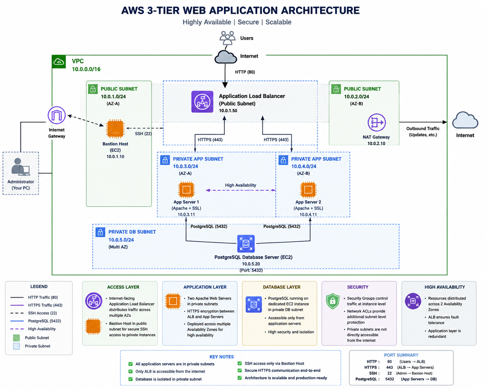

<div align="center">

# AWS 3-Tier Web Hosting Architecture

A secure and scalable **3-Tier Web Application Architecture** built on **Amazon Web Services (AWS)** using Virtual Private Cloud (VPC), Application Load Balancer, Apache Web Servers, and PostgreSQL Database Server.


</div>

---

# Project Overview

This project demonstrates the deployment of a secure and highly available **3-Tier Web Application Architecture** on AWS. The infrastructure follows AWS networking and security best practices by separating the presentation, application, and database layers into isolated components.

The application is hosted on Apache web servers deployed in private subnets, while client requests are managed through an Internet-facing Application Load Balancer. A dedicated PostgreSQL database server stores application data securely within a private subnet. Administrative access is provided exclusively through a Bastion Host.

---

# Architecture

<p align="center">

</p>

---

# Architecture Components

| Layer | AWS Service |
|---------|------------|
| Network | Amazon VPC |
| Internet Access | Internet Gateway |
| Outbound Internet | NAT Gateway |
| Load Balancing | Application Load Balancer |
| Compute | Amazon EC2 |
| Web Server | Apache HTTP Server |
| Database | PostgreSQL on EC2 |
| Secure Administration | Bastion Host |
| Security | Security Groups & Network ACLs |

---

# Features

- Custom Amazon VPC
- Public & Private Subnets
- Internet Gateway
- NAT Gateway
- Bastion Host
- Application Load Balancer
- Apache Web Servers
- Backend HTTPS Communication
- PostgreSQL Database Server
- Security Groups
- Network ACLs
- Route Tables
- High Availability
- Health Checks
- Secure SSH Access
- Three-Tier Architecture

---

# Architecture Flow

```text
                Internet
                    │
                    ▼
      Application Load Balancer
                    │
          HTTPS Backend Traffic
        ┌───────────┴───────────┐
        ▼                       ▼
 Application Server 1     Application Server 2
        │                       │
        └───────────┬───────────┘
                    │
             PostgreSQL Server
              (Private Subnet)

Administrator
      │
 SSH
      ▼
 Bastion Host
```

---

# AWS Services Used

- Amazon EC2
- Amazon VPC
- Public & Private Subnets
- Internet Gateway
- NAT Gateway
- Application Load Balancer
- Target Groups
- Route Tables
- Security Groups
- Network ACLs
- Elastic IP
- Amazon Linux
- Apache HTTP Server
- PostgreSQL

---

# Project Structure

```text
AWS-3Tier-Web-Hosting/
│
├── docs/
│   ├── 01-vpc.md
│   ├── 02-subnets.md
│   ├── 03-route-tables.md
│   ├── 04-security-groups.md
│   ├── 05-network-acls.md
│   ├── 06-ec2-instances.md
│   ├── 07-bastion-host.md
│   ├── 08-application-load-balancer.md
│   ├── 09-postgresql-server.md
│   ├── 10-testing-validation.md
│   ├── 11-deployment-steps.md
│   ├── 12-troubleshooting.md
│   └── architecture.png
│
├── screenshots/
├── Architecture.md
├── LICENSE
└── README.md
```

---

# Security Implementation

- Application servers deployed in private subnets.
- PostgreSQL server isolated in a private subnet.
- SSH access only through the Bastion Host.
- Security Groups used as instance-level firewalls.
- Network ACLs provide subnet-level protection.
- HTTPS enabled between the Application Load Balancer and backend web servers.
- Database accessible only from application servers.

---

# Deployment Workflow

1. Create a custom VPC.
2. Configure public and private subnets.
3. Attach the Internet Gateway.
4. Configure the NAT Gateway.
5. Create Route Tables.
6. Configure Security Groups.
7. Configure Network ACLs.
8. Launch the Bastion Host.
9. Launch two Apache Web Servers.
10. Launch the PostgreSQL Database Server.
11. Configure Apache and backend HTTPS.
12. Create the Application Load Balancer.
13. Configure Target Groups and Health Checks.
14. Validate application accessibility through the ALB.

---

# Testing & Validation

✔ Website successfully accessible through the Application Load Balancer.

✔ Target Group Health Checks passed.

✔ Backend HTTPS communication established.

✔ SSH access verified through the Bastion Host.

✔ PostgreSQL connectivity verified.

✔ Network security validated using Security Groups and Network ACLs.

---

# Challenges Faced

| Issue | Resolution |
|------|------------|
| Target Group Unhealthy | Corrected Network ACL configuration |
| HTTPS Timeout | Updated Security Groups and NACL rules |
| Apache SSL Configuration | Configured self-signed SSL certificates |
| Backend Connectivity | Verified routing and listener configuration |
| Health Check Failures | Fixed HTTPS access between ALB and EC2 |

---

# Documentation

| Document | Description |
|----------|-------------|
| VPC | Virtual Private Cloud Configuration |
| Subnets | Public & Private Subnets |
| Route Tables | Traffic Routing |
| Security Groups | Instance-Level Firewall |
| Network ACLs | Subnet-Level Security |
| EC2 Instances | Compute Resources |
| Bastion Host | Secure SSH Access |
| Application Load Balancer | Traffic Distribution |
| PostgreSQL Server | Database Layer |
| Testing & Validation | Infrastructure Testing |
| Deployment Steps | Complete Deployment Guide |
| Troubleshooting | Common Issues & Solutions |

---

# Future Improvements

- Auto Scaling Group
- Amazon RDS PostgreSQL
- AWS Certificate Manager (ACM)
- Route 53 Custom Domain
- AWS WAF
- CloudWatch Monitoring
- AWS Backup
- Terraform Infrastructure as Code
- CI/CD using GitHub Actions

---

# AWS 3-Tier Web Hosting Architecture

## Architecture

<p align="center">
  
</p>

This project demonstrates a secure and highly available **3-tier web application architecture** deployed on **Amazon Web Services (AWS)**. The infrastructure follows AWS best practices by separating the presentation, application, and database layers into different network tiers.

### Architecture Components

- **Amazon VPC** with public and private subnets
- **Internet Gateway** for public internet access
- **NAT Gateway** for outbound internet access from private subnets
- **Bastion Host** for secure SSH access
- **Application Load Balancer (ALB)** to distribute incoming traffic
- **Two Apache Web Servers (EC2)** in private subnets
- **PostgreSQL Database Server (EC2)** in a private subnet
- **Security Groups** and **Network ACLs** for network security
- **Route Tables** for traffic routing

## Project Structure

```
aws-3-tier-web-hosting/
├── architecture/
│   └── Architecture.png
├── docs/
├── screenshots/
├── website/
└── README.md
```

## Features

- Highly available web application deployment
- Secure three-tier architecture
- Load-balanced application servers
- Private database server
- Secure Bastion Host administration
- Layered network security
- Step-by-step deployment documentation

# Author

**Gargi Gogulwar**

B.Tech Computer Engineering  
Pimpri Chinchwad College of Engineering

GitHub: https://github.com/GargiGogulwar

---

## If you found this project useful, consider giving it a ⭐ on GitHub!
